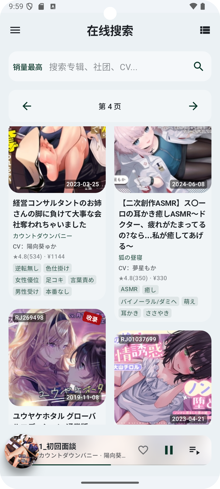
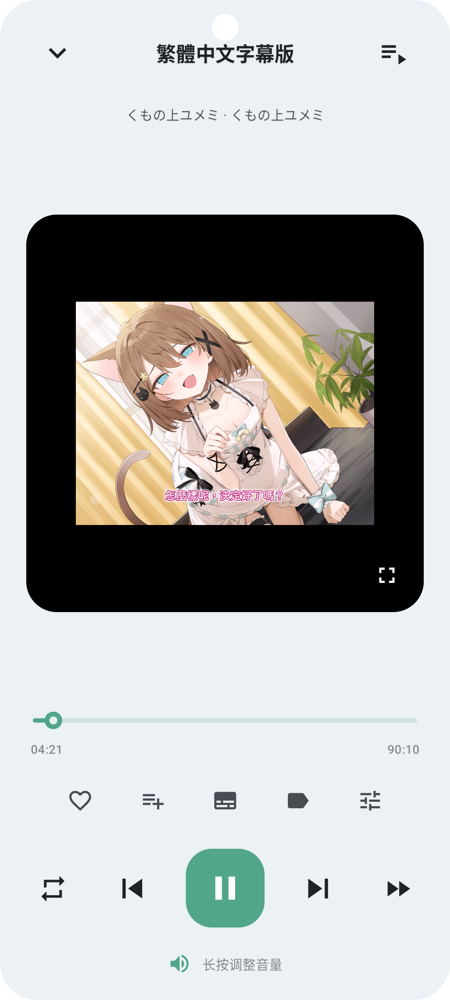

# ASMR Player (Android) 🎧

> **THIS REPOSITORY AND ITS CONTENT WERE GENERATED 100% BY AI.**

**中文宣传页 / Landing Page (ZH)**: [docs/landing_zh.md](docs/landing_zh.md)

## 中文简介

**ASMR Player（Android）** 是一款面向 ASMR 内容的本地播放器：以“专辑/曲目”的库管理体验为核心，提供同步歌词、后台下载、耳机向音效（均衡器/声道平衡/空间化）、左右声道频谱可视化与深度主题定制等“播放器级增强能力”。

## 📖 Overview

**ASMR Player (Android)** is a modern, feature-rich audio player specifically designed for ASMR content, built with **Jetpack Compose** and **Media3**. It offers a premium local library experience combined with powerful app-level features like playlist management, synchronized lyrics, background downloads, and deep customization.

*This repository is provided as-is and may be incomplete or experimental.*

---

## ✨ Features

- 🎧 **High-Fidelity Playback**: Powered by the robust **Media3 (ExoPlayer)** engine for seamless audio experiences.
- 🎨 **Modern UI/UX**: Crafted with **Jetpack Compose** and **Material 3** for a smooth, beautiful, and responsive interface.
- 📚 **Smart Library**: Effortlessly browse your local collection with optimized album and track views.
- 📑 **Playlist Management**: Create, edit, and manage your favorite tracks.
- 🎤 **Synchronized Lyrics**: Real-time lyric parsing and display for an immersive listening session.
- 📥 **Download Manager**: robust background downloads handled efficiently by **WorkManager**.
- 💾 **Offline Persistence**: Built on **Room** and **Paging 3** for instant access to your data, online or offline.
- 🌐 **Network Integration**: Uses **Retrofit** + **OkHttp** for reliable networking (includes HTML parsing via **Jsoup**).
- 🎚️ **Headphone Tuning**: Equalizer, reverb, gain, virtualizer, and L/R channel balance.
- 📊 **Stereo Visualizer**: Left/right channel spectrum designed for binaural content.
- 🪟 **Floating Lyrics**: Optional system overlay lyrics for multitasking.
- 🎞️ **Video Playback**: Supports common video formats and streams (e.g., `.mp4`, `.mkv`, `.webm`, `.m3u8`).

---

## 📦 Downloads

- Download from **GitHub Releases** (tag `v*`, latest is `v0.1.3`).
- Or build locally:

```bash
./gradlew :app:assembleDebug
```

---

## 🔐 Permissions (Brief)

- **Media / Storage access**: scan and play your local audio files.
- **Notifications**: playback controls and foreground service notification.
- **Overlay (optional)**: required only when enabling floating lyrics.

---

## 🌐 Content Sources (Built-in)

- **DLsite (scraping)**
- **DLsite Play library**
- **asmr.one API**

Use responsibly and comply with the laws and terms of service that apply to you.

---

## 📱 App Preview

### 📚 Immersive Library
Explore your audio collection with our versatile library views. Choose between a visual-rich grid layout or a detailed list view to suit your browsing style.

| **Album Grid** | **Album List** |
|:---:|:---:|
|  |  |

### 🔍 Search & Navigation
Find exactly what you're looking for. The track list provides quick access to your files, while the search screen helps you locate content instantly.

| **Track List** | **Smart Search** |
|:---:|:---:|
|  |  |

### 🎵 Player & Focus Mode
Immerse yourself in the sound (or video). The player interface features a calming visualizer, landscape mode for dedicated listening, synchronized lyrics, and **MP4 video playback** support.

| **Now Playing** | **Landscape Mode** |
|:---:|:---:|
|  |  |

| **Lyrics View** | **Video Playback** |
|:---:|:---:|
|  |  |

### ⚙️ Details & Settings
Deep dive into album metadata or customize the app to your liking. The settings screen puts you in control of the experience.

| **Album Details** | **Settings** |
|:---:|:---:|
|  |  |

---

## 🛠️ Tech Stack

- **Language**: Kotlin 100%
- **UI Toolkit**: Jetpack Compose (Material 3, Navigation)
- **Media Engine**: Media3 (ExoPlayer, Media Session)
- **Architecture**: MVVM, Clean Architecture principles
- **Dependency Injection**: Hilt + KSP
- **Data Persistence**: Room, DataStore
- **Async & Background**: Coroutines, Flow, WorkManager
- **Pagination**: Paging 3
- **Networking**: Retrofit, OkHttp, Jsoup
- **Image Loading**: Coil + Palette API

---

## 🚀 Project Setup

### Prerequisites

- **Android Studio**: Recent stable version recommended.
- **JDK 17**: Required by Android Gradle Plugin 8.x.
- **Android SDK**:
  - `compileSdk` / `targetSdk`: **34**
  - `minSdk`: **24**

### 🏃 Open and Run

1.  **Clone/Open** this project folder in Android Studio.
2.  Wait for **Gradle Sync** to complete.
3.  Select the `app` configuration and hit **Run** ▶️ on your device or emulator.

### 📦 Build from CLI

```bash
./gradlew :app:assembleDebug
```

### 📂 Build Output Location

To keep your project root clean, build outputs are redirected:
- **Default**: `<repo>/.build_asmr_player_android/`
- **Override**: Set `TRAE_BUILD_ROOT` environment variable.

---

## 📝 Configuration Notes

- `local.properties` is **excluded** from version control (auto-generated by Android Studio).
- ⚠️ **Security**: Never commit keystores (`*.jks`, `*.keystore`) or signing secrets.
 - **Networking headers**: This project separates image-loading headers from API networking to avoid cross-impact.

---

## ⚖️ Disclaimer

- This project is **not an official product** and is not affiliated with any platform, store, or brand referenced.
- The code may contain **bugs, incomplete implementations, or security issues**. Please review carefully before production use.
- You are responsible for complying with all applicable laws and terms of service for any third-party services accessed.
- **No warranties provided.** Use at your own risk.

---

## 🤖 AI Generation Notice

This repository (including documentation and code changes) is marked as **100% AI-generated**. Human review is strongly recommended.
